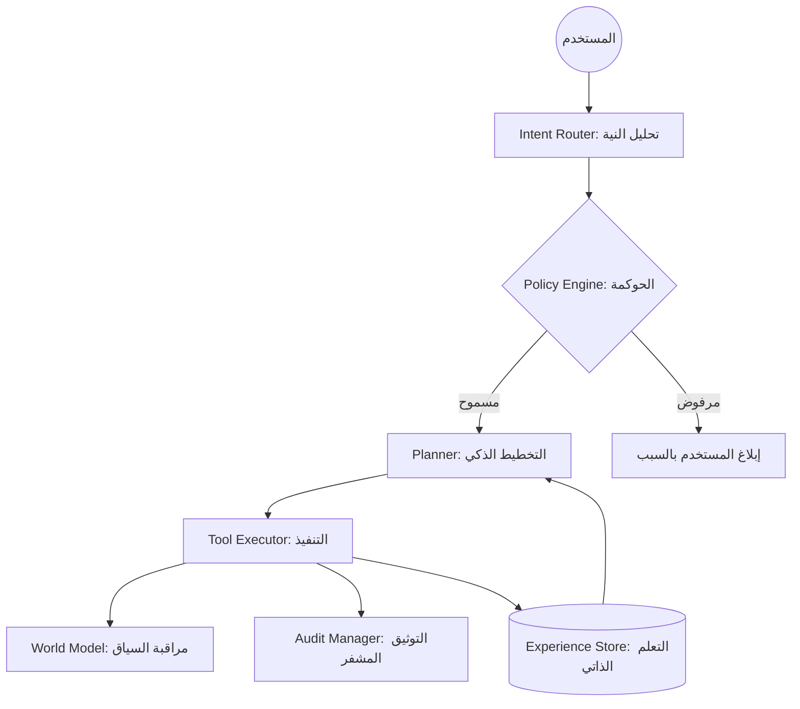

# 🧠 AIRI: Android Artificial Intelligence Runtime Interface
### *The Sovereign Operating Mind for Android*

---

## 🌌 الرؤية: ما وراء المساعد الذكي
**AIRI** ليست مجرد تطبيق دردشة أو واجهة لنموذج لغة؛ إنها **عقل تشغيلي محلي (Operating Mind)** مصمم ليعيد تعريف علاقتك بهاتفك الذكي. نحن نبني نظاماً إدراكياً يسكن في جيبك، يفهم نيتك، يخطط لأفعالك، وينفذ مهامك بسيادة كاملة وخصوصية مطلقة، دون الحاجة لقطرة واحدة من بيانات الإنترنت.

> "AIRI هو المحاولة الهندسية الأكثر طموحاً لتحويل الأندرويد من نظام تشغيل جامد إلى كيان إدراكي واعٍ بسياقه."

---

## 🚀 المزايا الثورية (The Powerhouse)

### 🛡️ السيادة الرقمية (Digital Sovereignty)
*   **معالجة محلية 100%**: لا بيانات تغادر جهازك. لا APIs خارجية. لا تتبع.
*   **نظام حكم رقمي (Policy Engine)**: أول مساعد ذكي يمتلك "دستوراً" داخلياً يحكم قراراته، مع بروتوكولات **Fail-Closed** لضمان الأمان المطلق.
*   **سجل أثر غير قابل للتلاعب (Immutable Audit Trail)**: كل قرار يُسجل في سلسلة مشفرة (Hashing Chain) لضمان الشفافية التامة.

### 🧠 المعمارية الإدراكية (Cognitive Architecture)
*   **Unified Cognitive Loop (UCL)**: دورة حياة إدراكية تبدأ من الإدراك (Perception) ← التفكير (Reasoning) ← التخطيط (Planning) ← التنفيذ (Execution).
*   **المخطط المطور ذاتياً (Self-Improving Planner)**: AIRI لا تكرر أخطاءها؛ فهي تمتلك ذاكرة إجرائية تقيم جودة الخطط السابقة وتتعلم منها لتحسين المستقبل.
*   **نموذج العالم (World Model)**: فهم عميق لحالة الجهاز (البطارية، الشبكة، السياق) وتقدير المخاطر قبل الإقدام على أي فعل.

### 🛠️ نظام الأدوات المفتوح (Tool Auto-Discovery)
*   **توسع لا نهائي**: أضف ميزات جديدة بمجرد إضافة ملف JSON. AIRI تكتشف الأدوات وتتعلم كيفية استخدامها تلقائياً.
*   **تكامل n8n**: ربط AIRI بمحركات الأتمتة العالمية لتنفيذ مهام معقدة عبر الـ Webhooks الموثقة.

---

## 🏗️ الهيكل المعماري (The Blueprint)

---

## 🛠️ الترسانة التقنية (Tech Stack)
*   **Core**: Kotlin & Coroutines لضمان الأداء المتوازي السلس.
*   **Brain**: `llama.cpp` عبر JNI لاستنتاج محلي فائق السرعة.
*   **Persistence**: Room & SQLite لإدارة الذاكرة طويلة المدى وسجل الخبرات.
*   **Intelligence**: نماذج GGUF المحسنة (Quantized) لتعمل بكفاءة على المعالجات المحمولة.
*   **Interface**: واجهة Overlay ذكية تعمل فوق كافة التطبيقات.

---

## 🗺️ خارطة الطريق (The Journey)

### 📍 المرحلة 1: التأسيس والسيادة (مكتملة ✅)
*   تشغيل النماذج محلياً واستقرار بنية الـ JNI.
*   بناء محرك السياسات وسجل الأثر المشفر.
*   تأسيس الـ Unified Cognitive Loop.

### 📍 المرحلة 2: الإدراك والتعلم (قيد التنفيذ 🚧)
*   تفعيل المخطط المطور ذاتياً (Self-Improving Planner).
*   دمج نموذج العالم (World Model) وتقدير المخاطر.
*   تحسين فهم محتوى الشاشة (Accessibility Context).

### 📍 المرحلة 3: الوعي الكامل والتكامل العميق
*   دعم تعدد الوكلاء (Multi-Agent System).
*   التعلم المستمر من سلوك المستخدم (Personalization).
*   التكامل العميق مع أنظمة الـ OSINT والأتمتة الأمنية.

---

## 🤝 المساهمة في الثورة
نحن لا نبني تطبيقاً، نحن نبني مستقبلاً يكون فيه الذكاء الاصطناعي ملكاً للمستخدم وليس للشركات. إذا كنت مهندساً، باحثاً، أو مهتماً بالخصوصية، فمكانك هنا.

1.  **Fork** المشروع.
2.  أنشئ فرعاً لميزتك (`git checkout -b feature/AmazingFeature`).
3.  **Commit** تعديلاتك (`git commit -m 'Add some AmazingFeature'`).
4.  **Push** للفرع (`git push origin feature/AmazingFeature`).
5.  افتح **Pull Request**.

---

## 📜 فلسفة AIRI
> "الذكاء بدون سيادة هو مجرد عبودية رقمية. AIRI موجودة لتعيد لك السلطة على بياناتك وقراراتك."

---
**تم التطوير بكل شغف ليكون AIRI هو العقل الذي يثق به هاتفك.**
