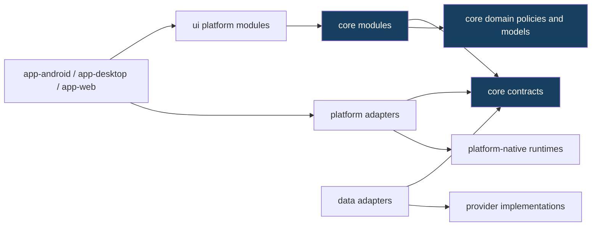

# البنية المستهدفة متعددة المنصات

## القرار

تعتمد AIRI تبنياً تدريجياً لـ **Kotlin Multiplatform** لتشغيل منطق الأعمال نفسه على Android وDesktop ثم Web، من دون إعادة كتابة التطبيق. يمنع KMP استعمال APIs المنصة في `commonMain`، بينما تسمح source sets الخاصة بالمنصة بالتطبيقات اللازمة [1]. وهذا يلائم AIRI لأن أكثر قيمة قابلة لإعادة الاستخدام هي سياسات الذاكرة والتخطيط والتوجيه والتحقق، لا `Activity` أو Room أو JNI.

لا يبدأ البرنامج بواجهة Compose مشتركة. Compose Multiplatform مستقر لـAndroid وDesktop، وWeb/Wasm في Beta [2]، لكن توحيد UI قبل فصل النواة سيخفي تسرب Android ويصعّب التشخيص. تشارك المنصات لاحقاً design tokens وstate models ومكونات مثبتة فقط، مع إبقاء تفاعل touch وkeyboard/window/browser مخصصاً لكل منصة.

## شكل الوحدات المستهدف

```text
airi/
├── app-android/                 # التطبيق الحالي بعد نقله تدريجياً من app/
├── app-desktop/                 # Windows/Linux؛ يبدأ بعد نجاح core
├── app-web/                     # Web هدف مستقل؛ يبدأ بعد Desktop
├── core/
│   ├── domain/                  # entities, invariants, policies
│   ├── agent/                   # planning, execution graph, cancellation
│   ├── memory/                  # admission, ranking, retrieval contracts
│   ├── routing/                 # model selection, fallback, retry policies
│   ├── skills/                  # manifest, validation, capability model
│   ├── attachments/             # neutral metadata and validation
│   ├── security/                # policy and error classification
│   └── contracts/               # platform/provider/repository interfaces
├── data/
│   ├── providers/               # cloud provider implementations
│   ├── persistence-android/     # Room/DataStore adapters
│   ├── persistence-desktop/     # desktop persistence adapter, when proven
│   └── persistence-web/         # IndexedDB/remote adapter, when proven
├── platform/
│   ├── android/                 # OAuth callbacks, picker, scheduler, JNI
│   ├── desktop/                 # filesystem, OAuth, native runtime, tray
│   └── web/                     # browser storage, redirect, permission APIs
└── ui/
    ├── design/                  # tokens and primitives proven portable
    ├── android/                 # touch-first Android UX
    ├── desktop/                 # keyboard/window-first desktop UX
    └── web/                     # responsive browser UX
```

هذا الشكل هو **اتجاه معماري**، وليس طلباً لنقل مجلدات المنتج دفعة واحدة. أول implementation ينشئ وحدة `core-domain` فقط، ويترك `app/` وRoom وJNI وواجهات Android في أماكنها حتى تتوافر أدلة التكامل.

## اتجاه التبعيات



**لا** تعتمد `core/**` على `app-*` أو `platform/*` أو `data/*`. تعتمد `data/*` و`platform/*` على العقود من الداخل إلى الخارج. يعتمد التطبيق على النواة والتطبيقات الخاصة بالمنصة معاً ويجمعها في composition root واحد.

## العقود المسموح بها

لا تنشأ interface إلا عند حد تحتاجه منصتان أو عند عزل عنصر Android موجود. العقود التالية واقعية بسبب الكود الحالي وحدود المنصات الموثقة.

| العقد | سبب وجوده | يظل خارج النواة | أول adapter |
| --- | --- | --- | --- |
| `PlatformModelRuntime` | JNI/llama.cpp تختلف بين Android وDesktop ولا تصلح للمتصفح كما هي. | CMake، تحميل المكتبة، CPU/GPU detection. | Android JNI adapter الحالي. |
| `MemoryRepository` | Room Android ليس persistence عاماً. | DAOs، migrations، SQL driver. | Room adapter الحالي. |
| `SecureTokenStore` | storage المشفر وkeychain/browser storage لا تتطابق. | Android Keystore، keyring، browser vault. | Android secure store الحالي. |
| `PlatformWebAuth` | callback وredirect وفتح المتصفح تختلف. | App Links، localhost listener، browser redirect. | Android OAuth implementation الحالي. |
| `PlatformFileSystem` | picker/URI/path/drag-drop lifecycle مختلف. | `Uri`، `ContentResolver`، JDK filesystem، File System Access API. | Android attachment acquisition. |
| `PlatformScheduler` | WorkManager لا يساوي alarm/cron/service worker. | WorkManager، OS scheduler، browser background APIs. | Android scheduling adapter. |
| `PlatformVoiceEngine` | microphone/STT/TTS engines وpermissions منصية. | AudioRecord، Vosk Android، browser Media APIs. | Android voice adapter. |
| `PlatformToolRegistry` | tools قد تمنح filesystem أو process أو browser privileges. | Android Context والأوامر والمنح. | Android tool bindings. |

لا يصبح `PlatformHttpClient` عقداً مستقلاً في البداية إذا اختير عميل HTTP متعدد المنصات موحد لاحقاً؛ أما `ModelProvider` فهو عقد أعمال مطلوب لأن اختلاف provider عن platform قائم بالفعل ويجب فصله عن transport.

## المصدر المشترك ومجموعات source sets

تبدأ الوحدة الأولى بهذه source sets فقط:

| Source set | مسموح | ممنوع |
| --- | --- | --- |
| `commonMain` | Kotlin stdlib، `kotlinx.coroutines` المتوافق، models وسياسات pure. | AndroidX، `java.*`، Room، JNI، `Uri`، WorkManager، مفاتيح حقيقية. |
| `commonTest` | `kotlin.test` واختبارات policy deterministic. | Android instrumentation وملفات جهاز. |
| `androidMain` | adapter لاستدعاء core من تطبيق Android. | تكرار policy من core. |
| `jvmMain` | كود مشترك لسطح المكتب إذا كان JVM-only. | افتراض أنه يعمل على Web. |
| `desktopMain` لاحقاً | filesystem وnative runtime وcallbacks لسطح المكتب. | Android APIs. |
| `webMain` لاحقاً | browser-safe implementations فقط. | secrets، JNI، filesystem desktop. |

تشير وثائق KMP إلى أن `java.io.File` لا يمكن أن يدخل المصدر المشترك إذا كانت الوحدة تستهدف native أو Web [1]. لذلك يفحص حارس المنصة `java.*` صراحةً ولا يكتفي بحظر `android.*`.

## تركيب التطبيق

```kotlin
// الشكل المقصود؛ ليس كوداً منتجاً في هذه المرحلة.
val agent = AgentRuntime(
    memoryRepository = platformMemoryRepository,
    modelProvider = configuredProvider,
    modelRuntime = platformModelRuntime,
    toolRegistry = platformToolRegistry,
    securityPolicy = sharedSecurityPolicy,
)
```

يبني كل تطبيق هذا الرسم من adapters معتمدة ومصرح بها. لا ينشئ core `Context` أو `Activity` ولا يقرأ database ولا يحمل مكتبة native ولا يفتح المتصفح مباشرة.

## عدم التوافق المقصود

| جانب | Android | Desktop | Web |
| --- | --- | --- | --- |
| النموذج المحلي | JNI/NDK حالي. | native executable/library مستقل عند التحقق. | غير مفترض؛ يحتاج دراسة WASM/WebGPU منفصلة. |
| التخزين | Room/DataStore. | SQLite أو persistence adapter مثبت. | IndexedDB أو خدمة متزامنة؛ لا Room Android. |
| المصادقة | App Link/custom scheme. | localhost/custom protocol مع PKCE. | redirect URI وPKCE؛ بلا secret عميل. |
| الخلفية | WorkManager. | OS scheduler أو عملية صريحة. | browser lifecycle/service worker بقيود. |
| UI | touch-first. | keyboard/mouse/window-first. | responsive/browser-first. |

## معيار نجاح البنية

تعد البنية `IMPLEMENTED` عندما تبني `core-domain` من `commonMain` من دون Android وتستخدمها Android بالفعل. يصبح كل target خارجي `BUILDS` فقط بعد إخراج artifact قابل للتشغيل، و`RUNTIME_VERIFIED` بعد اختبار قبول موثق من المصفوفة. لا يغيّر هذا البرنامج حالة `architecture-refactor` ولا يطلب دمجاً إليه قبل تحقق جميع بوابات الترقية.

## المراجع

[1]: https://kotlinlang.org/docs/multiplatform/multiplatform-discover-project.html "The basics of Kotlin Multiplatform project structure"
[2]: https://kotlinlang.org/docs/multiplatform/supported-platforms.html "Stability of supported platforms | Kotlin Multiplatform"
[3]: https://developer.android.com/kotlin/multiplatform "Kotlin Multiplatform | Android Developers"
