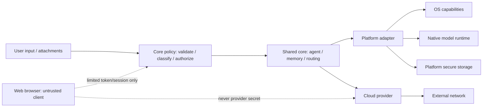

# نموذج الأمن متعدد المنصات

## النطاق والقاعدة الأساسية

تشارك AIRI سياسات الأمن وتصنيف الأخطاء وقرارات السماح في النواة، لكنها لا تشارك أسرار المنصة أو آليات تخزينها أو APIs للصلاحيات. كل طلب أداة أو مرفق أو provider يمر من **policy مشتركة** إلى **capability declaration** ثم إلى **adapter منصة** يطبق أقل صلاحية ممكنة. لا تملك النواة `Context` أو file path أو token أو native handle.

| الأصل | مثال | المالك | الخطر الرئيسي |
| --- | --- | --- | --- |
| محادثات وذكريات ومرفقات | prompts، RAG records، artifacts | repository adapter + core policy | تسرب إلى provider أو تخزين غير مشفر. |
| credentials | OAuth tokens، provider keys، connector secrets | secure store/platform أو backend موثوق | إدخالها في logs أو Web bundle. |
| model assets | GGUF/model metadata، native library | platform runtime | تحميل artifact غير موثوق أو كشف مسار المستخدم. |
| قدرات الأداة | filesystem، process، microphone، notifications | platform tool registry | تنفيذ قدرة دون موافقة أو خارج المنصة المعلنة. |
| نزاهة التنفيذ | stream، cancellation، agent step | core agent + platform adapter | callback قديم أو تنفيذ بعد إلغاء. |
| بيانات التشخيص | crash/telemetry | redaction pipeline | identifiers أو prompt أو secret ضمن التقرير. |

## حدود الثقة

## قواعد منع تسرب المنصة

| قاعدة | آلية التحقق | نتيجة المخالفة |
| --- | --- | --- |
| لا imports `android.*` أو `androidx.*` في `core/**/commonMain`. | فاحص platform dependency وصحة cross-platform اللاحقة. | يفشل CI. |
| لا Room أو WorkManager أو JNI أو `java.*` في common source. | فاحص patterns + Gradle dependency audit. | يعاد الكود إلى adapter أو jvm source set. |
| لا secret في source أو logs أو crash/telemetry. | `security_scan.py` وredaction tests ومراجعة config. | يفشل CI ويُدوّر secret إن انكشف. |
| لا tool قابلة للتشغيل قبل capability/platform/permission match. | `SkillManifest`/tool policy integration test. | ترفض قبل التنفيذ. |
| لا attachment قبل type/size/duplicate policy. | core attachment tests. | ترفض مع سبب آمن للمستخدم. |
| لا callback بعد cancel أو generation replacement. | cancellation/generation tests. | يهمل event ويغلق resource عند الإمكان. |

## اختلافات المنصات

| مجال | Android | Desktop | Web |
| --- | --- | --- | --- |
| مساحة الثقة | application sandbox + Android permissions. | user filesystem وOS account/keyring. | browser client غير موثوق وorigin/browser policy. |
| secrets | keystore/secure adapter. | OS vault/keyring مثبت. | لا secrets provider في bundle؛ server boundary أو public OAuth PKCE. |
| الملفات | scoped storage/URI وgrants. | path/drag-drop والـpermissions المحلية. | user-selected files/IndexedDB؛ لا مسارات OS عامة. |
| runtime محلي | JNI/NDK. | native binaries/ABI/signing. | لا JNI؛ دراسة WASM/WebGPU مستقلة. |
| background | WorkManager وقيود OS. | process/scheduler وقيود التثبيت. | lifecycle/service worker والـbrowser quotas. |
| network | app transport وpinning حيث يثبت. | system trust store/packaging policy. | CORS/HTTPS/Content Security Policy وbackend mediation. |

## Web security model

Web ليس "Desktop مصغراً". يعامل browser كعميل يمكنه فحص JavaScript وطلبات الشبكة. لذلك:

1. لا يحزم API key أو client secret أو private provider credential.
2. لا يصدق client-side authorization لعمليات تملك أثر حساب أو تكلفة أو صلاحية عالية.
3. يطبق server-side authorization وrate limits وaudit على endpoints التي تحتاج secret أو وصولاً واسعاً.
4. يقيّد CORS إلى origins المعتمدة ويعتمد HTTPS وCSP مناسبة عند التنفيذ.
5. يراجع IndexedDB/cache/service worker بحثاً عن data retention وlogout clearing.
6. يتعامل مع file/microphone/camera permission كقرار browser مستقل واضح للمستخدم.

لا تصبح أي من هذه الضوابط `IMPLEMENTED` قبل target Web حقيقي ومراجعة أمنية. إنها الآن `ARCHITECTED`.

## Skills، tools، وconnectors

يحمل كل skill manifest قابلاً للتدقيق يذكر: الاسم/version، المنصات المتاحة، permissions، network requirement، filesystem scope، model requirement، وdata classification. يحسب registry التوفر من تقاطع `skill requirements ∩ platform capabilities ∩ user grant ∩ policy`. إذا لم يتحقق تقاطع آمن، لا يظهر skill كمتاح ولا يُنفذ fallback مخفي.

تدخل الأدوات التي تنفذ process أو filesystem أو connector من خلال allowlist، timeout، cancellation، scope ضيق، وaudit event لا يحتوي payload حساساً. لا يدير core process من دون adapter منصة؛ هذا ضروري لـAndroid sandbox وDesktop OS وWeb browser model.

## التحكم في المرفقات والنماذج

تظل `AttachmentPolicy` وMemory admission policies مشتركة لتوحيد حماية الحجم/type/dedup. أما قراءة البيانات فتتم من adapter acquisition. يتحقق model runtime من signature/hash إن توفر، يخزن metadata آمنة، ولا يسجل raw model path أو user directory. تتطلب artifacts خارجية مصدر trusted وlicense/SBOM review قبل التوزيع.

## التحقق والتصعيد

| فئة التحقق | موجود الآن | مطلوب لاحقاً |
| --- | --- | --- |
| static source security | `tools/security_scan.py` | توسيعه لمسارات `core` وWeb bundle قبل كل target. |
| Android permissions/provider | فحص Manifest وFileProvider قائم | instrumented regression عند تغيير adapter. |
| core policy | اختبارات JVM لبعض السياسات | `commonTest` عند Gate 2. |
| Desktop OS integration | غير متاح الآن | filesystem/vault/runtime/packaging tests لكل OS. |
| Web browser security | غير متاح الآن | CORS/CSP/auth/storage/permission review في browser فعلي. |
| external provider/IdP | requires credentials | يسجل `EXTERNAL_VERIFICATION_REQUIRED` ولا يخمن نجاحه. |

## معيار الإغلاق الأمني

يحتاج أي milestone قابل للترقية إلى: مراجعة diff للحدود، نجاح scanners والاختبارات، عدم وجود secrets في artifacts، SBOM محدث عند إضافة dependency، وجدول أدلة للمنصات التي يعلنها. لا يرفع نجاح Android وحده حالة أمن Windows/Linux/Web.
